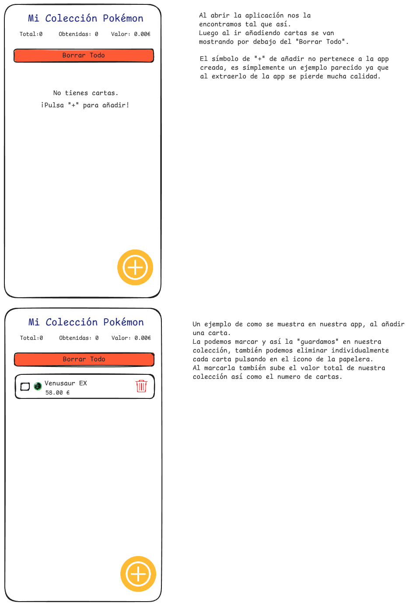

<div align="center">

# 📦 PGL-MyList-PokemonCards

*Una aplicación móvil para gestionar tu colección de cartas Pokémon, construida con React Native y Expo.*

</div>

<p align="center">
  
  
  
</p>

## ✨ Sobre el Proyecto

Esta aplicación te permite crear y gestionar una lista personal de **cartas Pokémon**. Puedes añadir nuevas cartas a través de un formulario, ver estadísticas clave de tu colección, marcar las cartas que ya tienes y mantener todo organizado.

---

## 🧩 Estructura del proyecto

```
/components
 ├── CardItem.tsx          # Representa una carta individual
 ├── icons/                # Iconos SVG personalizados
/constants
 ├── categories.tsx        # Categorías de tipos Pokémon
 ├── iconMap.tsx           # Asignación de iconos a categorías
/screens
 └── CollectionScreen.tsx  # Pantalla principal de la app
/types
 └── index.tsx             # Tipado de objetos y estadísticas
App.tsx                    # Punto de entrada de la aplicación
```

---

## 📱 Funcionalidades principales

- **👁️ Visualizar tu colección**: Ve todas tus cartas en una lista clara y ordenada.
- **📊 Estadísticas al instante**: Monitoriza el número total de cartas, cuántas tienes marcadas y el valor total de la colección.
- **➕ Añadir cartas fácilmente**: Un formulario modal te permite añadir nuevas cartas con su nombre, precio y categoría.
- **✅ Marcar como obtenidas**: Lleva un registro de las cartas que ya posees.
- **🗑️ Gestión de la lista**: Elimina cartas de forma individual o limpia toda la colección con un solo botón.

---

## 🧮 Enlaces a ejercicios

| Ejercicio | Tema                      | Archivo                                                              |
|-----------|---------------------------|----------------------------------------------------------------------|
| 1         | Diseño y pantallas        | [Ejercicio1_Diseño.md](./docs/Ejercicio1_Diseño.md)                       |
| 2         | Tipado y componente lista | [Ejercicio2_Tipado_y_Lista.md](./docs/Ejercicio2_Tipado_y_Lista.md)       |
| 3         | Borrado y marcado         | [Ejercicio3_Borrado_y_Marcado.md](./docs/Ejercicio3_Borrado_y_Marcado.md) |
| 4         | Formulario modal          | [Ejercicio4_FormularioModal.md](./docs/Ejercicio4_FormularioModal.md)     |
| 5         | Borrado total             | [Ejercicio5_BorradoTotal.md](./docs/Ejercicio5_BorradoTotal.md)           |

---

## Imagen ExcaliDraw



--- 

## 🧑‍💻 Instalación y ejecución

```bash
# 1️⃣ Clonar el repositorio
git clone https://github.com/("cambiar por tu usuario")/PGL-MyList-PokemonCards.git
cd PGL-MyList-PokemonCards

# 2️⃣ Instalar dependencias
npm install

# 3️⃣ Ejecutar en modo desarrollo
npm run start
```

---

## 🧠 Autor

Desarrollado  por **Alejandro Guzmán Pérez**

[GitHub](https://github.com/srgurmi) 
